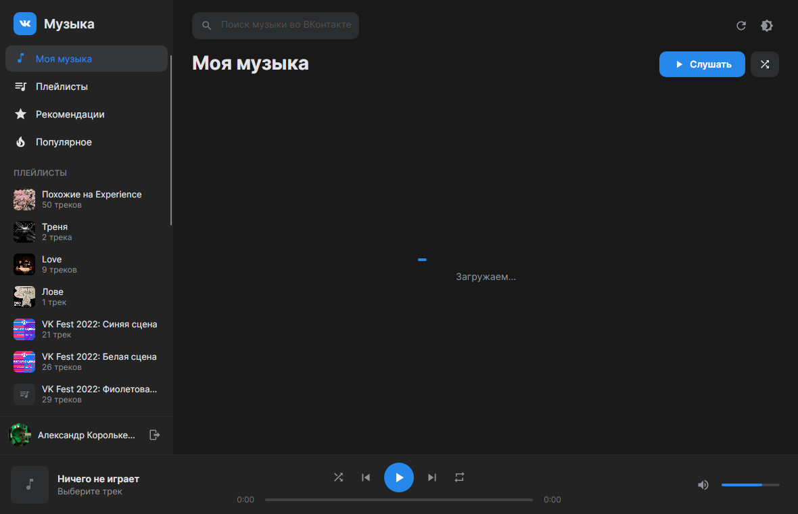
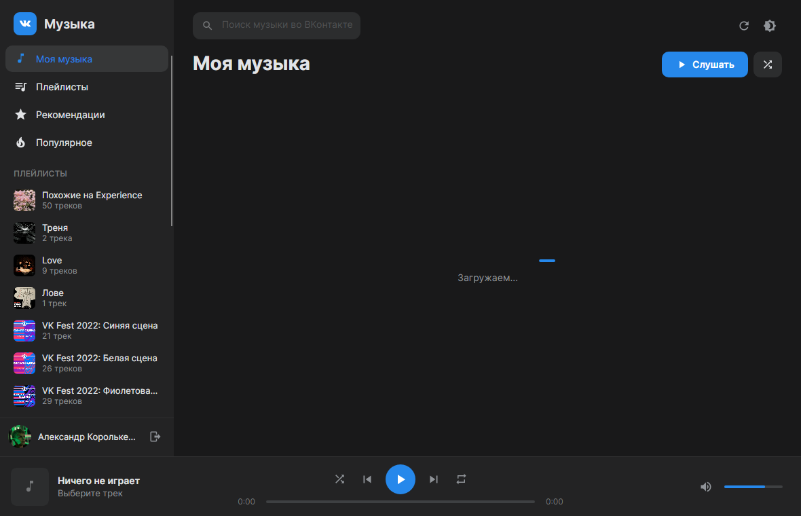
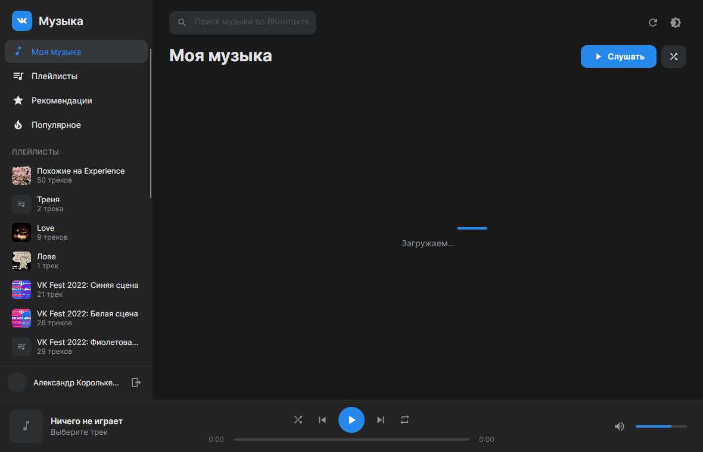
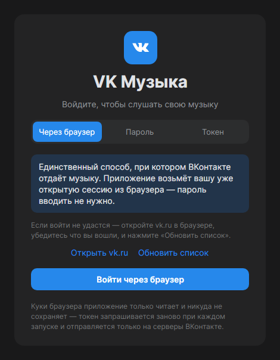

# VK Музыка

Нативный десктопный клиент музыки ВКонтакте для Arch Linux. Написан на C# (.NET 10)
на Avalonia, интерфейс повторяет дизайн ВК — тёмная и светлая темы, фирменный синий,
боковое меню, список треков и нижняя панель плеера.

Только музыка: ни ленты, ни сообщений, ни всего остального.



<table>
  <tr>
    <td width="50%"></td>
    <td width="50%"></td>
  </tr>
  <tr>
    <td align="center"><sub>Светлая тема</sub></td>
    <td align="center"><sub>Плейлисты</sub></td>
  </tr>
</table>

<p align="center"></p>
<p align="center"><sub>Окно входа</sub></p>

## Что умеет

**Музыка**
- Моя музыка, Плейлисты, Рекомендации, Популярное
- Поиск по всей музыке ВКонтакте
- Открытие любого плейлиста, подгрузка следующих страниц при прокрутке
- Добавить трек к себе / удалить из своей музыки
- Текст песни в боковой панели
- Скачать трек в `~/Музыка/VK Музыка` (без перекодирования)

**Плеер**
- Воспроизведение, пауза, следующий и предыдущий трек
- Перемотка по полосе прогресса, громкость, отключение звука
- Перемешивание и три режима повтора (выкл / список / один трек)
- Обложки с кэшем на диске
- Громкость, тема, режимы повтора и размер окна запоминаются

**Горячие клавиши**

| Клавиши | Действие |
| --- | --- |
| `Пробел` | Играть / пауза |
| `←` / `→` | Перемотка на 10 секунд |
| `Ctrl+←` / `Ctrl+→` | Предыдущий / следующий трек |
| `↑` / `↓` | Громкость |
| `M` | Выключить звук |
| `Ctrl+F` | Перейти к поиску |
| `Esc` | Закрыть текст песни / очистить поиск |
| Медиаклавиши | Play/Pause, вперёд, назад |

## Требования

```bash
sudo pacman -S dotnet-sdk ffmpeg libpulse
```

- **ffmpeg** — декодирует потоки ВК (в том числе HLS с шифрованием AES-128)
- **libpulse** — вывод звука в PipeWire/PulseAudio. Если её нет, приложение
  само переключится на `pw-cat`, `paplay` или `aplay`

Для запуска готовой сборки достаточно `dotnet-runtime` вместо `dotnet-sdk`.

## Установка

### Пакетом Arch Linux (рекомендуется)

Готовый пакет лежит в [релизах](https://github.com/milcorix/vkmusik/releases):

```bash
sudo pacman -U vkmusik-1.0.0-1-x86_64.pkg.tar.zst
```

Или собрать самому из `PKGBUILD`:

```bash
cd packaging
makepkg -si
```

### Без пакета, в домашний каталог

```bash
./install.sh
```

Скрипт соберёт релиз в `~/.local/share/vkmusik`, положит запускалку в
`~/.local/bin/vkmusik` и добавит пункт в меню приложений.

### Запуск из исходников

```bash
dotnet run --project src/VkMusik
```

## Вход

**Через браузер — основной способ.** Откройте vk.ru в Firefox и войдите там обычным образом.
Дальше в приложении нажмите «Войти через браузер»: оно возьмёт уже открытую сессию,
получит веб-токен и всё заработает. Пароль приложение не видит и не хранит.

Почему именно так: ВКонтакте раздаёт методы `audio.get`, `audio.search`, `audio.getById`
по белому списку приложений. Токен, полученный обычной авторизацией (в браузере, по QR
или логином с паролем), получает от ВК ответ `Unknown method passed` — метод для него
просто не существует. Единственный клиент, которому эти методы открыты, — веб-плеер
самого ВКонтакте, и работает он на токене из браузерной сессии.

Что проверено и **не** работает (оставлено в приложении только как запасные вкладки):

| Способ | Результат |
| --- | --- |
| Токен из `oauth.vk.com/authorize` | вход есть, музыки нет — `audio.get` → ошибка 3 |
| Вход по QR-коду (VK ID) | вход подтверждается, но токен ВК стороннему клиенту не отдаёт |
| Логин с паролем под Kate Mobile | ВК держит на нём `Flood control`, музыка тоже закрыта |
| `auth.refreshToken` с receipt | новый токен выдаётся, музыку не открывает |

Куки браузера приложение только читает и никуда не копирует: веб-токен запрашивается
заново при каждом запуске и живёт около 15 минут, после чего обновляется автоматически.
Профиль браузера запоминается в `~/.config/vkmusik/session.json` — только путь, без секретов.

Поддерживаются Firefox, LibreWolf, Floorp и Zen. Если профилей несколько, приложение
даст выбрать нужный.

## Как это устроено

```
src/VkMusik/
  Audio/          звук: ffmpeg → PCM → PulseAudio
    FfmpegAudioPlayer.cs   плеер: очередь команд, позиция, пауза, перемотка
    PulseSimpleSink.cs     вывод через libpulse-simple (P/Invoke)
    ProcessAudioSink.cs    запасной вывод через pw-cat / paplay / aplay
  Services/       VK API, авторизация, кэш обложек, хранение настроек
    BrowserCookies.cs      читает сессию ВК из cookies.sqlite браузера
    VkWebAuth.cs           веб-токен ВКонтакте и его автообновление
  Models/         разбор ответов ВК
  ViewModels/     состояние приложения и команды
  Views/          окна входа и плеера
  Controls/       VkIcon и VkSeekBar
  Styles/         палитра ВК, иконки, темы контролов
```

**Звук.** Готовых биндингов к звуку под Linux в .NET нет, поэтому цепочка своя:
`ffmpeg` декодирует источник (mp3 или зашифрованный HLS-плейлист ВК) в сырой
float32-PCM на stdout, приложение читает его, применяет громкость и блокирующе
пишет в PulseAudio через `libpulse-simple`. Блокирующая запись сама задаёт темп
воспроизведения, а `pa_simple_get_latency` даёт точную позицию трека с поправкой
на то, что ещё лежит в буфере звукового сервера.

Пауза — это остановка записи в буфер, перемотка — перезапуск ffmpeg с `-ss` и
сбросом очереди сервера. Буфер держится небольшим (200 мс), чтобы пауза
срабатывала без заметной задержки; при старте нового отрезка идёт короткое
нарастание громкости, чтобы не было щелчка.

**Ссылки на файлы.** Ссылки ВК живут около суток и привязаны к сессии, поэтому перед
каждым воспроизведением URL перезапрашивается через `audio.getById`. Отдаётся HLS-плейлист
с mp3 внутри (320 kb/s) — ffmpeg разбирает его сам.

## Ограничения

- Нужна открытая сессия ВКонтакте в Firefox. Без браузера музыка недоступна —
  это ограничение ВКонтакте, а не приложения.
- Раздел «Популярное» ВКонтакте местами уже не отдаёт через API — приложение
  честно скажет об этом и предложит рекомендации или поиск.
- «Рекомендации» часто возвращают пустой список.
- Создание и редактирование плейлистов не поддерживается — только прослушивание.
- Приложение неофициальное: оно представляется веб-плеером ВКонтакте, потому что
  другого способа получить доступ к музыке у сторонних клиентов не осталось.

## Лицензия

MIT.
